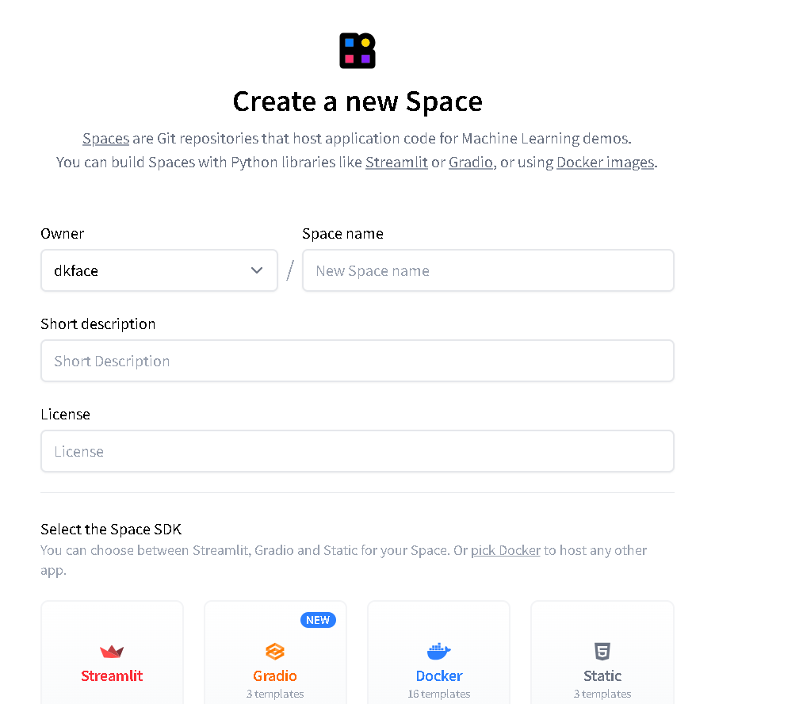

## The one with light wieght:  

(https://huggingface.co/spaces/dkface/kdu-test)

## The one with weight

https://huggingface.co/spaces/dagrodiluksha/kdu-demo1

##  Groc APIs
https://console.groq.com/keys

##  Openai APIs

https://platform.openai.com/docs/overview

login >> go to profile >>  https://platform.openai.com/settings/organization/api-keys

# Procedure:

## 1. open a venv environment:

python -m venv venv

## 2. activate the venv:

venv/Scripts/activate

## 3. install required packages:

pip install -r requirements.txt

## 4. create env file:

create new file >> .env >> YOUR_API = "API_KEY"

## 5. run the .ipynb file

## 6. run the .py file

# Deploy in Hugging Face

https://huggingface.co/spaces  >> New Space

name >> Gradio >> hardware >> public/ private >> create  >> Add Files >> Upload files >> 1. app.py
                                                                                        2. requirements.txt
                                                                                        3. utils.py

